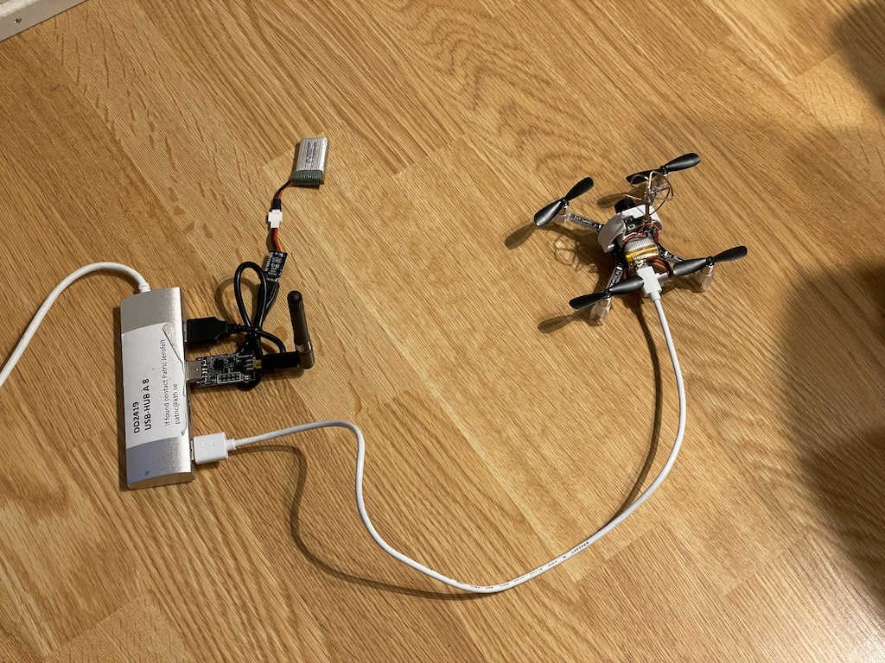

# Control assignment using a Crazyflie drone
Repository for a control assignment in the WASP Autonomous Systems course

## Your task
Your task is to write code that makes the drone follow the reference signal as closely as possible. The reference signal is a square wave with period 10s. That is, 5s at 20degs, 5s at -20degs, 5s at 20degs, and so on. 

 . 

In the video above you see an example of what it might look like when the drone osscilated between +/-20 degrees. In this example the code is written in C as part of the firmware of the drone and ran 1kHz. While this allows you to use the provided UI seen in the video it does make the overall assignment much harder given the limited time we have here. Therefore, in this assignment, we will instead make use of the python client library for the communicating with the drone from an external computer.

Please follow he instructions below to install the needed code. You will be given a skeleton to start from. You do not need to worry about changing the yaw reference value, it will be done for you in the skeleton.

## Installation
We will offer two options to run the code. The first one is to use Linux or MacOS and the second is to use a virtual machine provided by the company Bitcrazy that sells the Crazyflie drones. 

In the examples below we will put all new code in the directory wasp_as_cf to make it easy to clean up after the assignment.

#### MacOS and Linux
To avoid a system wide installation of all the dependencies we run the code in a virtual environment
<pre>
mkdir wasp_as_cf
cd wasp_as_cf
virtualenv -p python3 cfenv
source cfenv/bin/activate
</pre>
You should now see that you are in this environment by looking at the prompt in the terminal. It might look like
<pre>
(cfenv) patric@PJMacPro wasp_as_cf_yawswing % 
</pre>
That is, the prompt is pre-fixed with the name of the virtual environment.

If you close the terminal where you ran this you need to re-run the activate command. To get out of the virtual environment you run
<pre>
deactivate
</pre>

Create a directry where you keep the crazyflie python library code
<pre>
cd wasp_as_cf
git clone https://github.com/bitcraze/crazyflie-lib-python.git
cd crazyflie-lib-python.git
pip3 install -e .
</pre>

##### USB under Linux
With linux, the crazyradio is easily recognized, but you have to setup UDEV-permissions. Look at the usb [permission instructions](https://github.com/bitcraze/crazyflie-lib-python/blob/master/docs/installation/usb_permissions.md) to setup udev on linux.

#### Virtual machine
* Download and install VirtualBox (https://www.virtualbox.org/wiki/Download_Old_Builds_6_1). We used 6.1.40 when testing this
* Install also the Extension pack when you installed VirtualBox (https://download.virtualbox.org/virtualbox/6.1.40/Oracle_VM_VirtualBox_Extension_Pack-6.1.40.vbox-extpack)
* You find the virtual machine image built by BitCraze here (https://github.com/bitcraze/bitcraze-vm/releases/)
* You find instruction from BitCraze here (https://github.com/bitcraze/bitcraze-vm). Note that
  * The CrazyRadio must be seen by the virtual machine which you ensure by selecting it under Devices/USB in the top menu.
  * The password is crazyflie (login name bitcraze).
  * Is your virtual machine freezing when you resize the window? For me it was solved by increasing the Graphics memory to 128MB in Settings (power down VM first).

## Geting the skeleton code
Go to the directory we created for the code and download the skeleton
<pre>
cd wasp_as_cf
git clone git:https://github.com/pjensfelt/wasp_as_cf_yawswing.git
cd wasp_as_cf_yawswing
</pre>

## Before starting
* Be nice to the drone. They are used in a course and should be handed back in the same shape as you got them.
* How to use the motors to make the drone rotate arond its vertical axis? This is probably the first thing you want to think about or perform experiments to figure out.
* The thrust (upward force) on the drone is the sum of forces from the motors. Tthe drone should stay on the surface, which means that you might want to think about the max signals you can send to the motors without the drone taking off and then ensure that your signals stay below that.
* Note that your task is to make the estimated yaw angle track the reference yaw angle. Since the estimate might drift the actual angle of the drone might not move between +/-20degs which is fine. What matters is making the estimated yaw track the references.

## Running the code
* First you need to make sure that the radio module is connected to your machine and detected.
* Connect the battery on the drone. Keep the USB-cable plugged in whenever you are not testing soemthing as this will charge the battery. You can run the drone with the cable connected also but it will be difficult to rotate.
* Turn on the drone by pressing in (GENTLY!!!) the small black push button in-between two of the arms 
 . 
* Make sure that the drone is standing on a flat surface when you do this as the drone's IMU calibrates upon boot.
* Opening the code cf_yawswing.py and edit the URI (line 14) matches the channel of your drone
* Run the code with <pre> 
python3 cf_yawswing.py
</pre>
You should see that it connects to your drone and it should start printing information in the terminal
<pre>
(cfenv) patric@PJMacPro wasp_as_cf_yawswing % python3 cf_yawswing.py
Wating for a connection
Connecting to radio://0/83/2M
WARNING:cflib.crazyflie.log:Error no LogEntry to handle id=1
WARNING:cflib.crazyflie.log:Error no LogEntry to handle id=2
Connected to radio://0/83/2M
Disabling controller
Waiting for position estimate to be good enough...
Ready! Press e to enable motors, h for help and Q to quit
yaw: (curr=0.44396063685417175, ref=60, err=59.55603936314583),   battery:3.64V
     control: (False, 10000, 10000, 10000, 10000)
</pre>
If you rotate the drone you should see how the current angle change ("curr" above). You can also see how the reference angle changes between +45 and -45. The row that starts with control contains the contains a flag for Enable/Disable the motors followed by the PWM values that controls the speed of the four motors. The latter values can be set between 0 (not moving) and 65535 (max speed).

You are expected to change the code that now sets the PWM signal to 10,000 for all four motors, i.e.
<pre>
    def calc_control_signals(self):
        # Calculate the error between the reference yaw signal and the current yaw
        yaw_err = self.angle_difference(self.yaw_ref, self.yaw_curr)

        # YOUR CODE STARTS HERE
        # In the code below set the variables m1, m2, m3, m4 appropriately
        # They should each take on values in [0,65535] which is taken care of
        # by the function limit_int below

        m1 = 10000
        m2 = 10000
        m3 = 10000
        m4 = 10000

        # YOUR CODE ENDS HERE

        # Set the control variables and make sure that they are
        # integers and between 0 and 65535
        self.motor_pwm1 = self.limit_int(m1, 0, 0xFFFF)
        self.motor_pwm2 = self.limit_int(m2, 0, 0xFFFF)
        self.motor_pwm3 = self.limit_int(m3, 0, 0XFFFF)
        self.motor_pwm4 = self.limit_int(m4, 0, 0XFFFF)
</pre>

## Suggested setup
Below you see the suggested setup
 
* The USB cable is connected to the drone to charge the battery onboard whenever you are not performing an experiment that requires the drone to be free.
* The CrazyRadio USB antenna is connected
* An extra battery is being charged

## Q&A
* Q: How do I plot the result? 
* A: The python file is setup to output a csv file with SPACE separator. You can open the file is for example excel or MATLAB. In MATLAB you could do
<pre>
d=load('log_20221101_141838.csv');
plot(d(:,1),d(:,2),d(:,1),d(:,3)), grid, xlabel('Time [s]'), ylabel('Yaw angle [deg]'), legend('Current yaw','Reference yaw')
</pre>
* Q: The propellors are not moving despite me enabling the motors and setting a PWM value. What is wrong?
* A: Reset the drone by pressing the black push button.
* Q: The system tells me that numpy is not install, BUT I JUST RAN IT AND IT WORKED?!?!?!?!
<pre>
patric@vpn37-186 wasp_as_cf_yawswing % python3 cf_yawswing.py
Traceback (most recent call last):
  File "/Users/patric/Dropbox/Documents/code/wasp_as_cf_yawswing/cf_yawswing_P.py", line 9, in <module>
    import numpy as np
ModuleNotFoundError: No module named 'numpy'
</pre>
* A: Did you change terminal and forgot to active the virtual environment?
<pre>
cd wasp_as_cf
source cfenv/bin/activate
</pre>
* Q: No connecttion to the drone?
* A: Did you set the correct URI? If you use a Virtual Machine, did you remember to hand over the CrazyRadio PA to the Virtual Machine (see instructions above).
* Q: No permission to access the crazyradio USB antenna on your linux machine? 
* A: Check that you have set the udev-permissions (see section above on USB under Linux)
